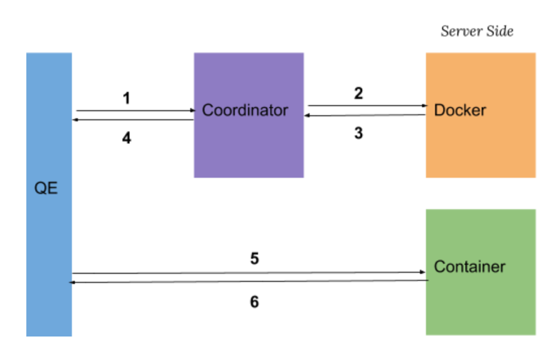

## Overview
Coordinator is a background worker in PostgreSQL/Greenplum. It decouples container management from backend process, so that plcontainer extension can focus on connecting to a compute service and retrieving result to the upper nodes within the plan tree.

## Memory and Variables
#### Shared Memory
* coordinator_address (protocol+address)
#### Local Memory
* HTAB *client_info_map
	Map request_id(pid of QE) to its detailed info. All containers are linked in a single list.
* HTAB *runtime_map
	Map the relation from runtime_id to docker configuration.
	See `plcontainer_configuration.xml` in data directory.
## GUCs
* int max_container_number
	The maximum number of containers allowed to exist concurrently.

* int check_loop_delay

  The time in seconds to indicate how long to check a QE is still alive.
## Communication

1. QE sends `(QE_PID, runtime_id)` to the coordinator.
2. After receiving message from QE, coordinator creates a new request to Docker to allocate a container. 
3. For each received coordinator request, Docker allocates a container and sends container’s information back to the coordinator. 
4. Coordinator tells QE the `UDS address` corresponding to its request.

5 & 6.  QE repeatedly sends the `Ping Message` to the allocated Container until it receives a `Ping Response` from the Container.

## Cache

In the above communication model, for every function call, QE will send a request to coordinator and wait until a newly created container becomes ready. This could cause a huge time delay before the function really being executed. To minimize the time delay, containers are cached for the same session, i.e. when a query is finished, its corresponding container will not be released immediately. The container will be running in idle mode, so that future query request with same runtime_id can directly reuse it.

## Check Loop

Since the QE keeps long connection with one or more containers for reusing, the container(s) will not be released if the coordinator is not notified that "the QE will exit, please release all containers used by it". There must be a mechanism to do some cleanup. A simple idea is that coordinator periodically checks whether the QE is still alive. If the QE is gone, the coordinator will request the docker to release all containers used the the QE.

## Initialization

* Initialize shared memory
  * init coordinator state to `uninitialized`
  * init unix domain socket
  * set unix domain socket address in shared memory
* Load container runtime configuration
* Set state of coordinator to `ready` in shared memory
* Enter main loop
  * Receive request from QE
  * Check whether there is a dead QE and do cleanup
  * Reload container runtime configuration if needed

## Shutdown

Release all containers requested by the coordinator itself.